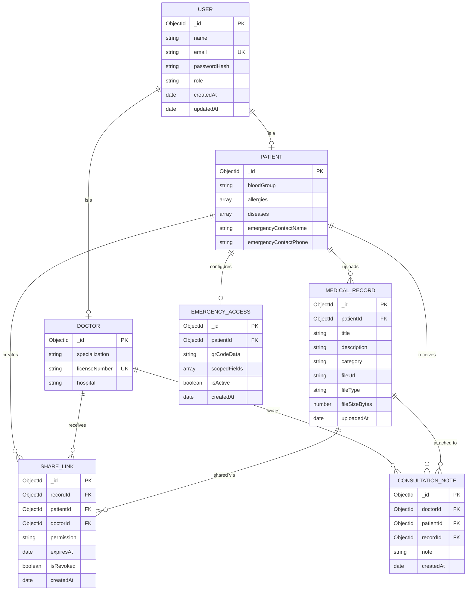

# MediVault — ER Diagram (Mermaid)

> This diagram renders natively on GitHub. For the visual PNG export, see `er-diagram.png` in this folder.

---

## Relationships Summary

| From Entity | To Entity | Cardinality | Verb |
|-------------|-----------|-------------|------|
| USER | PATIENT | 1 : 0..1 | is a (discriminator) |
| USER | DOCTOR | 1 : 0..1 | is a (discriminator) |
| PATIENT | MEDICAL_RECORD | 1 : N | uploads |
| PATIENT | SHARE_LINK | 1 : N | creates |
| DOCTOR | SHARE_LINK | 1 : N | receives |
| MEDICAL_RECORD | SHARE_LINK | 1 : N | shared via |
| DOCTOR | CONSULTATION_NOTE | 1 : N | writes |
| PATIENT | CONSULTATION_NOTE | 1 : N | receives |
| MEDICAL_RECORD | CONSULTATION_NOTE | 1 : N | attached to |
| PATIENT | EMERGENCY_ACCESS | 1 : 0..1 | configures |

---

## Enums

### `role` (USER)
| Value | Description |
|-------|-------------|
| `patient` | Registered patient user |
| `doctor` | Registered doctor user |

### `category` (MEDICAL_RECORD)
| Value | Description |
|-------|-------------|
| `lab_report` | Laboratory test results |
| `prescription` | Doctor-issued prescriptions |
| `imaging` | X-ray, MRI, CT scan files |
| `discharge_summary` | Hospital discharge documents |
| `vaccination` | Vaccination records |
| `insurance` | Insurance documents |
| `other` | Miscellaneous documents |

### `permission` (SHARE_LINK)
| Value | Description |
|-------|-------------|
| `view` | Doctor can view the record online only |
| `download` | Doctor can download the file |
| `view_and_download` | Doctor can both view and download |

---

> **Note:** PATIENT and DOCTOR are implemented as Mongoose discriminators on the USER collection. They share the same MongoDB collection (`users`) and are differentiated by the `role` field. This avoids join overhead while maintaining schema-level separation of concerns.
